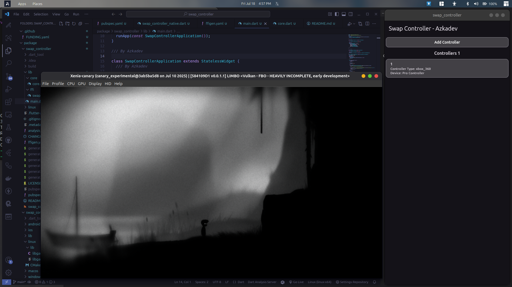
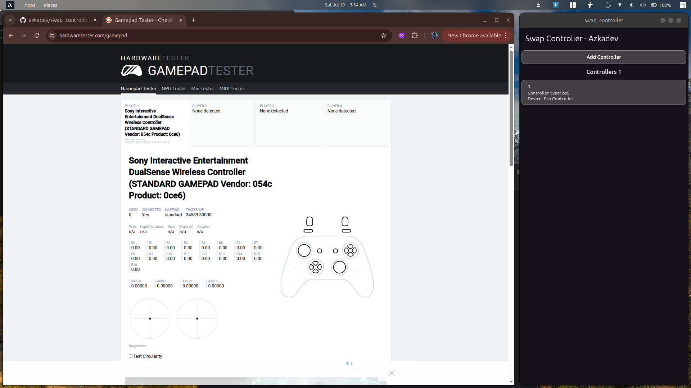
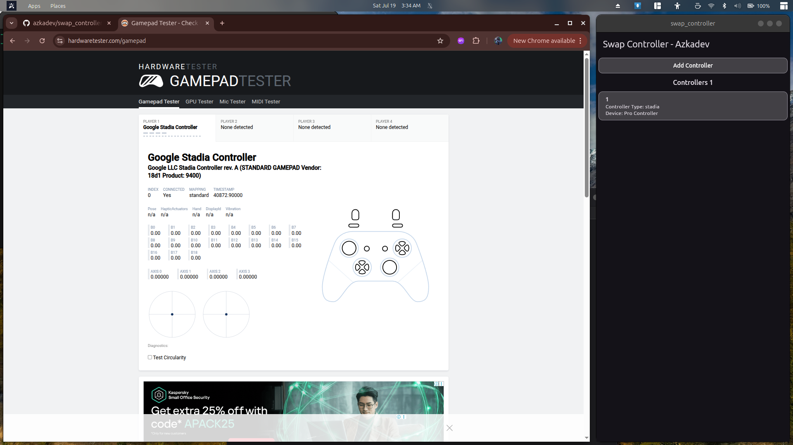

# Swap Controller 

Sebuah program sederhana yang memungkinkan kamu mengemulasi / simulasi / istilah umumnya mapping button. 

## Screenshots

---

## Inti Penting

program ini memungkinkan controller bluetoth kamu menjadi layaknya kabel sehingga kontroller switch bisa berkamuflase layaknya menggunakan usb dan sebagai device lain

## Supported Fake Gamepad

untuk saat ini hanya sedikit yang bisa saya emulasi, jadi misal kontroller game pad kamu *NINETENDO SWITCH PRO CONTROLLER* atau apapun itu kamu bisa menjadikan controller kamu di bawah ini

1. [x] ps4
2. [x] ps5
3. [x] switch_pro
4. [x] xbox_one
5. [x] xbox_one_s
6. [x] stadia
7. [x] xbox_360

## Pertanyaan umum

> Q: Untuk siapa program ini?
> A: siapa saja, terutama jika kamu memiliki gamepad bukan xbox

> Q: kenapa harus pakai
> A: terserah kamu, karena beberapa gamepad selain xbox jika koneksi via bluetooth tidak bisa bermain game / hanya beberapa tombol saja yang berfungsi itu pun kadang tombol acak, sehingga program ini menghadirkan solusi untuk kamu yang ingin tetap koneksi bluetooth tanpa harus beli gamepad xbox

> Q: Kenapa Ui tidak kaya?
> A: ya saya sedikit pemalas, karena ini program open source juga jadi saya tidak membuat dengan ui yang sebagus mungkin, karena saya juga bekerja di suatu perusahaan yang akan menggunakan program ini

## Penting

Ini hanya sebuah program edukasi, tidak ada maksud untuk mengajak orang tidak membeli kontroller yang emang bisa koneksi bluetooth layaknya xbox.

## Installing

Saat ini hanya tersedia linux, untuk platform lain saya belum terlalu minat karena saat ini saya main game hanya menggunakan linux terutama ubuntu 24

rm -rf *.deb
wget --continue 
sudo dpkg --force-all -i 

## Update Akan Datang

saat ini saya sedang sedikit sibuk, ini adalah beberapa fitur yang mungkin akan datang

1. [ ] Remapping
2. [ ] Multi Controller

jika kamu merasa ingin saya segera update silahkan bantu saya dengan cara di bawah ini ya

## Support Me

Jika kamu merasa program ini berguna, kamu bisa support saya [GITHUB AZKADEV](https://github.com/azkadev) di link itu tersedia social media dan sponsor saya. saya tidak keberatan jika kamu hanya follow / donasi uang sedikit

Terimakasih

Azkadev - 18-07-2025