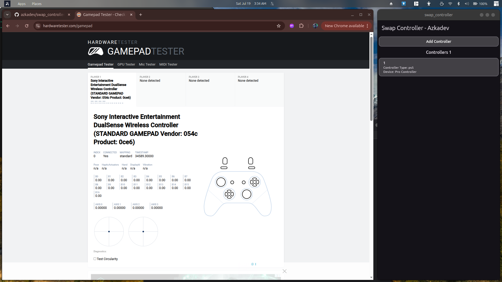

# Swap Controller

A simple program that lets you emulate/simulate/generally, button mapping.

## Screenshots





---

## README

1. [Indonesia](./README.md)
2. [English](./README_EN.md)

## Key Takeaways

This program allows your Bluetooth controller to act like a cable, allowing the Switch controller to disguise itself as a USB device and act as another device.

## Supported Fake Gamepads

Currently, I can only emulate a few. For example, if your gamepad controller is **NINETENDO SWITCH PRO CONTROLLER** or whatever, you can use the following controllers:

1. [x] ps4
2. [x] ps5
3. [x] switch_pro
4. [x] xbox_one
5. [x] xbox_one_s
6. [x] stadia
7. [x] xbox_360

## Frequently Asked Questions

> Q: Who is this program for?
> A: Anyone, especially if you have a non-Xbox gamepad.

> Q: Why should you use it?
> A: It's up to you. Some non-Xbox gamepads won't play games when connected via Bluetooth, or only a few buttons work, and even then, they sometimes work randomly. This program offers a solution for those who want to maintain a Bluetooth connection without having to buy an Xbox gamepad.

> Q: Why isn't the UI rich?
> A: Well, I'm a bit lazy. Since this is an open source program, I didn't make it with the best possible UI. I also work for a company that will use this program.

## Important

This is simply an educational program; it's not meant to discourage people from buying a controller that can connect to Bluetooth like an Xbox.

## Installation

Currently, it's only available for Linux. I'm not too interested in other platforms because I currently only play games using Linux, especially Ubuntu 24.

```bash
rm -rf swap-controller.deb
wget --continue https://github.com/azkadev/swap_controller/releases/download/latest/swap-controller.deb
sudo dpkg --force-all -i swap-controller.deb
```

## Upcoming Updates

I'm a bit busy right now, so here are some features that might be coming soon.

1. [ ] Custom Remapping
2. [ ] Multiplayer Controller (Player 2, 3, 4, and more)

If you'd like me to update it soon, please help me by following the steps below.

## Support Me

If you find this program useful, you can support me on [AZKADEV'S GITHUB](https://github.com/azkadev). The link provides my social media and sponsorship information. I don't mind if you just follow or donate a small amount.

Thank you.

Azkadev - 07-18-2025

## Tags

- reWaSd Linux
- Linux gamepad mapping
- Linux gamepad
- fake device